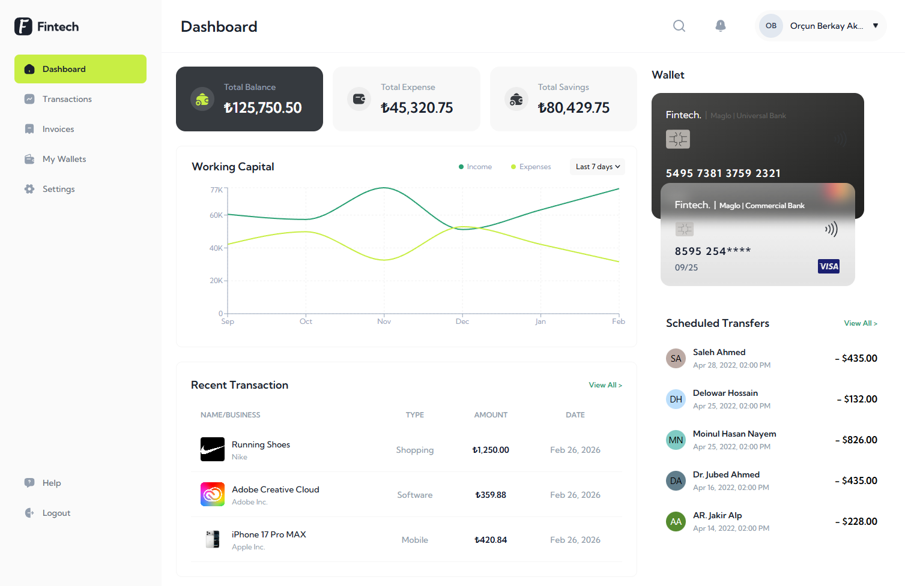

# React Fintech Dashboard

A modern fintech dashboard experience built for real-world product standards—fast, resilient, and scalable.  
Developed with React, Vite, TypeScript, and React Query to deliver responsive UX, reliable data flows, and maintainable architecture.

## 🔗 Live Demo
- Production: `https://react-fintech-dashboard.vercel.app/`

## 📸 Preview



## ✨ Features

- Authentication (Login / Register)
- Protected routes and access control
- Financial overview and KPI summary cards
- Working capital analytics with interactive chart
- Wallet cards and transaction insights
- Recent transactions table
- Scheduled transfers module
- Global API error handling (React Query + centralized handler)
- Global Error Boundary fallback layer
- Responsive dashboard (desktop + mobile sidebar/navigation)

## 🛠️ Tech Stack

### Frontend Core
- React 19
- TypeScript
- Vite

### Data & Networking
- TanStack React Query
- Axios

### Form & Validation
- Formik
- Yup

### UI & Visualization
- Tailwind CSS
- Recharts
- React Toastify

---

## 📁 Project Structure

```bash
src/
  app/
    layouts/
    providers/
    router/
  features/
    auth/
    dashboard/
  shared/
    config/
    lib/
    ui/
